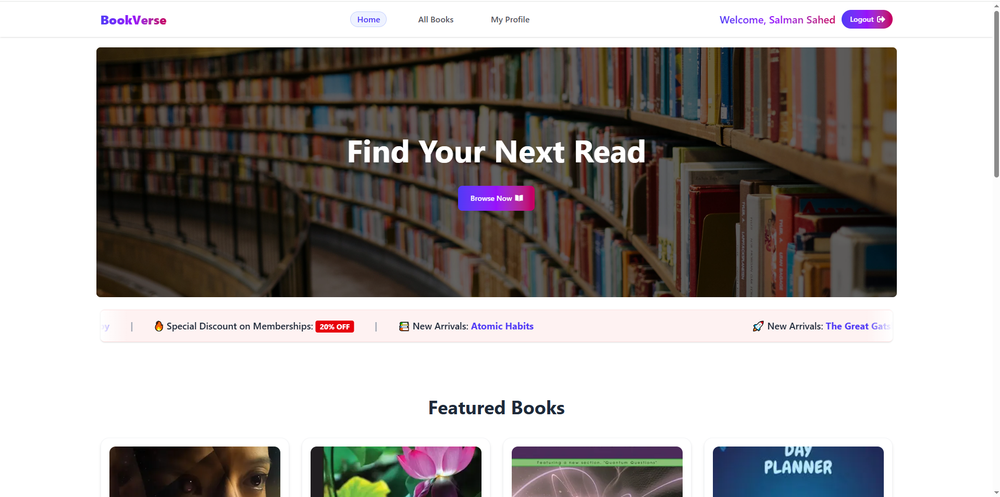
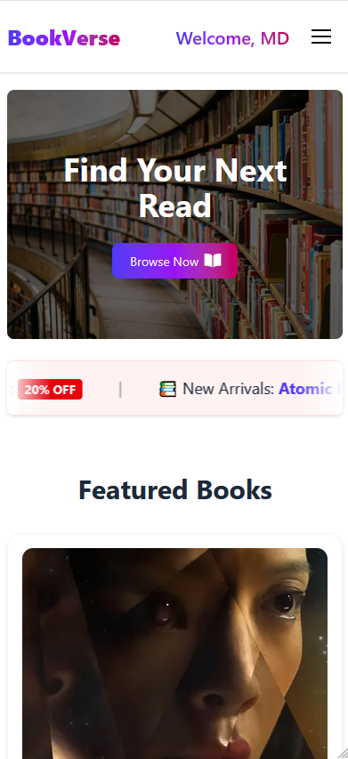

# 📚 BookVerse - A Modern Library Management System

BookVerse is a modern web application designed to transform the traditional library experience into a digital platform. Through this platform, users can easily browse books, filter by categories, and borrow books digitally.

## 🌐 Live Link

🔗 https://book-verse-library.vercel.app/

---

## 📸 Project Screenshots

<p align="center">
  <table>
    <tr>
      <td align="center" valign="center">
      <h3>Desktop View</h3>
        
      </td>
      <td align="center" valign="center">
      <h3>Mobile View</h3>
        
      </td>
    </tr>

  </table>
</p>

---

## 📖 Project Purpose

The main goal of this project is to make library management simple and user-friendly. Special emphasis has been given to security and performance so that users can seamlessly browse a large collection of books without interruption.

---

## ✨ Key Features

- **User Authentication:** Secure email and Google social login system using BetterAuth.
- **Auth Guard:** Automatically redirects users to the home page after login.
- **Dynamic Search:** Advanced search bar to quickly find books by title.
- **Category Filtering:** Functional sidebar to filter books by categories (e.g., Story, Tech, Science).
- **Private Routes:** Login required to view book details and borrow books.
- **Responsive Design:** Fully responsive layout for mobile, tablet, and desktop devices.
- **User Profile:** View personal information and update name & profile picture when needed.

---

## 🛠️ Tech Stack Used

- **Frontend:** Next.js (App Router), Tailwind CSS
- **UI Library:** HeroUI
- **Authentication:** BetterAuth
- **Database:** MongoDB Atlas

---

## 📦 NPM Packages Included

- `better-auth` (for implementing a secure and comprehensive authentication system including email and social login)
- `react-icons` (for icons)
- `react-hot-toast` (for notifications)
- `swiper` (for building an interactive and responsive slider to showcase user testimonials)
- `react-fast-marquee` (for creating smooth, infinitely scrolling text animations for new arrivals or announcements)
- `hamburger-react` (for interactive hamburger menu icon in the responsive mobile navbar)

---
## 🚀 Getting Started

### Clone the Repository

```bash
git clone https://github.com/salmansahed/book-verse-library.git
```

### Navigate to Project Directory

```bash
cd book-verse-library
```

### Install Dependencies

```bash
npm install
```

### Configure Environment Variables

Create a `.env.local` file in the root directory and add:

```env
MONGODB_URI=your_mongodb_connection_string

BETTER_AUTH_SECRET=your_secret_key
BETTER_AUTH_URL=http://localhost:3000
```

### Run Development Server

```bash
npm run dev
```

Open:

```text
http://localhost:3000
```

---

**Developed with ❤️ by [Salman Sahed](https://github.com/salmansahed)**
